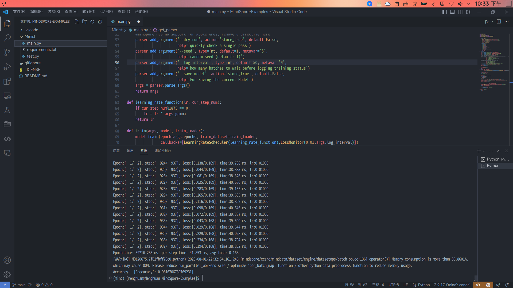

# MNIST例子
(中文 | [English](Readme.md))

pip install -r requirements.txt

python main.py

当epoch=2时，此模型准确度为98.16%

当epoch=14时，原模型准确度为99.22%

[原项目地址](https://github.com/pytorch/examples/tree/main/mnist)
